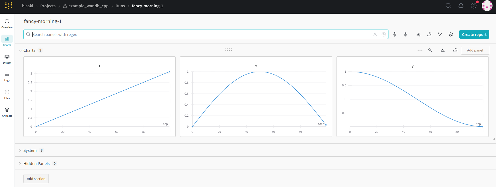
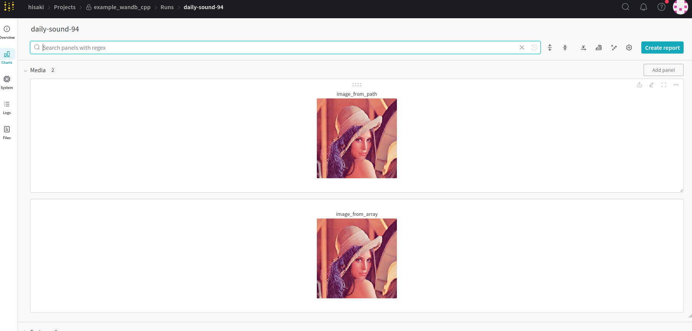
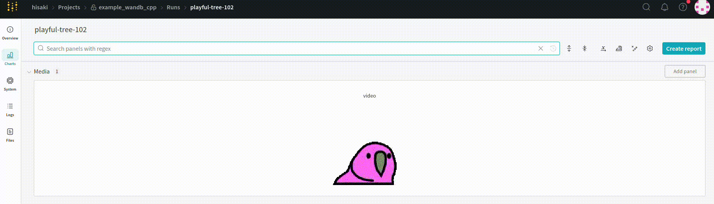
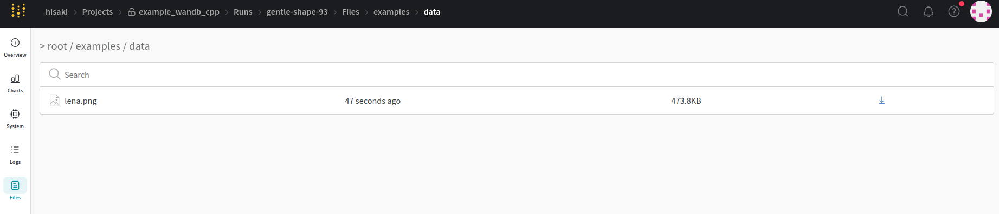
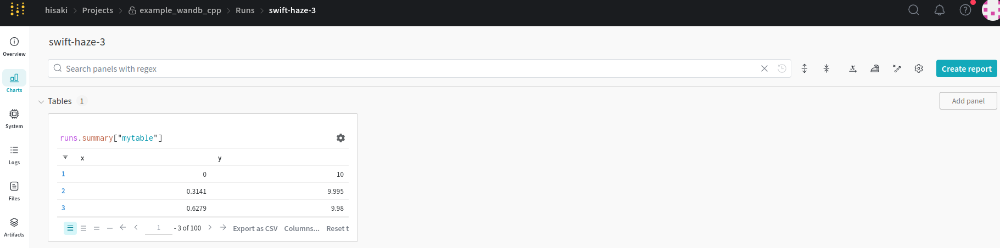
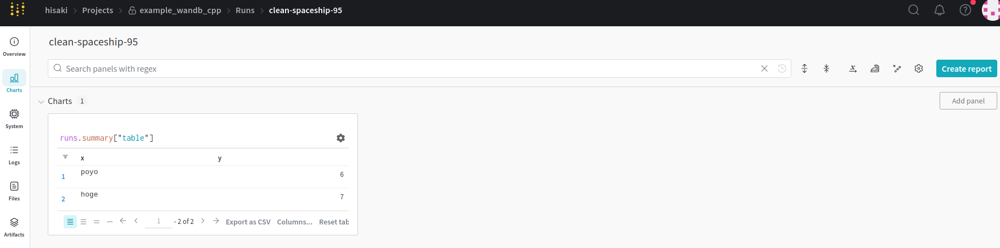
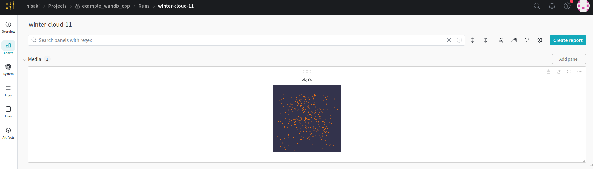

<p align="center">
  
  
</p>


# WandB-CPP

Unofficial C++ binding for [Weight & Biases](https://wandb.ai/site).

## Installation

wandb-cpp works by wrapping the [Weight & Biases](https://wandb.ai/site).So, you need to install wandb according to [this procedure](https://docs.wandb.ai/quickstart) first.

```bash
pip install wandb
```

The required Python packages are listed in the requirements.txt file.

## Usage

### Basic Usage

Execution result is [here](https://wandb.ai/hisaki/example_wandb_cpp/runs/2runz37w)!

```cpp
#include <cmath>
#include <iostream>

#include "wandbcpp.hpp"

int main() {
  wandbcpp::init({.project = "example_wandb_cpp", .tags = {"basic"}});

  int N = 100;

  wandbcpp::update_config({{"N", N}, {"mode", "abc"}});

  for (int i = 0; i < N; i++) {
    double t = M_PI * i / N;
    double x = std::sin(M_PI * i / N);
    double y = std::cos(M_PI * i / N);
    wandbcpp::log({{"t", t}, {"x", x}, {"y", y}});
    std::cout << "i : " << i << std::endl;
  }

  wandbcpp::finish();
}
```


### Upload Image

Execution result is [here](https://wandb.ai/hisaki/example_wandb_cpp/runs/g5lgkjja)!

```cpp
#include <opencv2/opencv.hpp>
#include "wandbcpp.hpp"

int main()
{
  wandbcpp::init({.project = "example_wandb_cpp", .tags = {"image"}});
  cv::Mat img = cv::imread("examples/data/lena.png");
  wandbcpp::log({{"image_from_array", wandbcpp::Image(img)}});
  wandbcpp::log(
      {{"image_from_path", wandbcpp::Image("examples/data/lena.png")}});
  wandbcpp::finish();
}
```



### Upload Video

Execution result is [here](https://wandb.ai/hisaki/example_wandb_cpp/runs/t23edtdv)!

```cpp
#include <opencv2/opencv.hpp>
#include "wandbcpp.hpp"

int main() {
  cv::VideoCapture cap("examples/data/parrot.mp4");

  if (!cap.isOpened()) {
    std::cerr << "Error: Video file not opened." << std::endl;
    return 1;
  }

  std::vector<cv::Mat> frames;

  while (true) {
    cv::Mat frame;
    cap >> frame;
    if (frame.empty()) break;

    frames.push_back(frame);
  }
  std::cout << "Number of frames: " << frames.size() << std::endl;

  wandbcpp::init({.project = "example_wandb_cpp", .tags = {"video"}});

  wandbcpp::log({{"video", wandbcpp::Video(frames.begin(), frames.end())}});

  wandbcpp::finish();
}
```



### Save File

Execution result is [here](https://wandb.ai/hisaki/example_wandb_cpp/runs/1g5qxcfh)!

```cpp
#include "wandbcpp.hpp"

int main() {
  wandbcpp::init({.project = "example_wandb_cpp", .tags = {"save file"}});
  wandbcpp::save("examples/data/lena.png");  // save this source code
  wandbcpp::finish();
}
```



### wandb.Table

- use `add_data`

  Execution result is [here](https://wandb.ai/hisaki/example_wandb_cpp/runs/2m6djvut)!

  ```cpp
  #include <cmath>

  #include "wandbcpp.hpp"

  int main() {
    wandbcpp::init({.project = "example_wandb_cpp", .tags = {"table"}});
    int I = 10;
    int J = 100;

    for (int i = 0; i < I; i++) {
      wandbcpp::Table table({"x", "y"});
      for (int j = 0; j < J; j++) {
        double x = (i + 1) * std::sin(M_PI * j / J);
        double y = (i + 1) * std::cos(M_PI * j / J);
        table.add_data({x, y});
      }
      wandbcpp::log({{"mytable", table}});
    }
    wandbcpp::finish();
  }
  ```
  

- use `add_column`

  Execution result is [here](https://wandb.ai/hisaki/example_wandb_cpp/runs/3ijm1cne)!

  ```cpp
  #include "wandbcpp.hpp"

  int main() {
    wandbcpp::init({.project = "example_wandb_cpp", .tags = {"table"}});
    wandbcpp::Table table;
    std::vector<double> x = {1.0, 2.0, 3.0};
    std::vector<int> y = {4, 5, 6};
    table.add_column("x", {x.begin(), x.end()});
    table.add_column("y", {y.begin(), y.end()});
    wandbcpp::log({{"table", table}});
    wandbcpp::finish();
  }
  ```

  

- passing data in the constructor

  Execution result is [here](https://wandb.ai/hisaki/example_wandb_cpp/runs/liy6u81n)!

  ```cpp
  #include "wandbcpp.hpp"

  int main() {
    wandbcpp::init({.project = "example_wandb_cpp", .tags = {"table"}});
    int I = 10;
    for (int i = 0; i < I; i++) {
      wandbcpp::Table table({"x", "y"}, {{"poyo", i}, {"hoge", i + 1}});
      wandbcpp::log({{"table", table}});
    }
    wandbcpp::finish();
  }
  ```

  

### wandb.Object3D

- plot pointcloud

  Execution result is [here](https://wandb.ai/hisaki/example_wandb_cpp/runs/8o6pb0jn)!

  ```cpp
  #include <array>
  #include <random>

  #include "wandbcpp.hpp"

  std::array<double, 3> gen_random_point() {
    static std::random_device seed_gen;
    static std::mt19937 engine(seed_gen());
    static std::uniform_real_distribution<> dist(-1.0, 1.0);
    return {dist(engine), dist(engine), dist(engine)};
  }

  int main() {
    namespace np = wandbcpp::numpy;

    wandbcpp::init({.project = "example_wandb_cpp", .tags = {"object3d"}});

    int num_points = 300;

    std::vector<std::array<double, 3>> point_cloud(num_points);

    std::generate(point_cloud.begin(), point_cloud.end(), &gen_random_point);

    auto lst = wandbcpp::topylist(point_cloud.begin(), point_cloud.end());

    wandbcpp::log({{"obj3d", wandbcpp::Object3D{np::ndarray{lst}}}});

    wandbcpp::finish();

    return 0;
  }
  ```

  

## Build examples

```
mkdir build && cd build
cmake -D BUILD_WANDBCPP_EXE=ON ..
make
```

### CMake options

- `BUILD_WANDBCPP_EXE` : Build examples. Default is `OFF`.
- `USE_OPENCV` : To save image, use OpenCV. Default is `OFF`.

## Implementation & Performance

This library executes most of its operations in multi-threaded mode. Therefore, this library should have little impact on the performance of the main processing.
